Welcome to the INCOB 2023 Introduction to Machine Learning in Bioinformatics Workshop!
++++++++++++++++++++++++++++++++++++++++++++++++++++++++++++++++++++++++++++++++++++++

.. raw:: html

  Copyright (c) 2023 <a href="https://orcid.org/0000-0002-9207-0385">Tyrone Chen </a>, <a href="https://orcid.org/0000-0002-8797-3168">Navya Tyagi </a>, <a href="https://orcid.org/0000-0003-0181-6258"> Sonika Tyagi </a>.

Associated code is provided under a `MIT license`_. 
Tutorial and workshop content is provided under a `CC-BY-3.0 AU license`_.
 
.. _MIT license: https://opensource.org/licenses/MIT

.. _CC-BY-3.0 AU license: https://creativecommons.org/licenses/by/3.0/au/

Overview
========

The Introduction to Machine Learning and Bioinformatics Workshop is short interactive workshop to introduce basic concepts of machine learning predictive modeling for genomics data. This workshop is given as part of the `22nd International Conference on Bioinformatics`_. 

Please feel free to contact us directly if you have any questions about the workshop contents, machine learning, or if you have questions in this space and wish to collaborate with us. We can be contacted through email at tyrone.chen@monash.edu and sonika.tyagi@rmit.edu.au. If you find a bug or issue with the tutorial code, please feel free to submit an issue.

.. _22nd International Conference on Bioinformatics: https://incob.apbionet.org/incob23/

.. raw:: html

    
    

.. 

Acknowledgements
================

Content of the workshop was developed by members of the `Tyagi Lab`_ and the Australian Bioinformatics and Computational Biology Student Society, (`COMBINE`_), a Research Student Group which is part of the International Society for Computational Biology (RSG `ISCB`_ AU). The workshop was supported by `Australian BioCommons`_ through the provision of compute resources and assistance in setting up the training environments made available to the workshop participants. We thank all collaborators and service providers for their support.

.. _Australian BioCommons: https://www.biocommons.org.au

.. _COMBINE: https://www.combine.org.au/

.. _ISCB: http://www.iscb.org/

.. _Tyagi lab: https://bioinformaticslab.erc.monash.edu/

The `Tyagi lab`_'s expertise is in implementing Bioinformatics methods and machine learning models to solve biological research and clinical outcome questions. The two research focus areas for the group are: (A) multimodal data integration for personalised medicine and (B) integrative genomics. (A) We utilise cutting edge AI and genomics technologies with significant outcomes for the academic and clinical communities to discover new treatments and improve healthcare. Our approach employs machine learning methods to automatically learn complex features from individual data types, and harmonise heterogeneous multimodal information. (B) Our research interest in integrative genomics is to combine data from multiple genomics layers to generate gene regulatory signatures. We have developed computational methods to integrate epigenomics and transcriptomics data. We study non-coding parts of the genome comprising DNA regulatory elements such as promoters and enhancers and genomic regions encoding for small and long non-coding RNAs (ncRNA). You can contact Sonika Tyagi directly at sonika.tyagi@rmit.edu.au.

`COMBINE`_ is a national student society for students in computational biology, bioinformatics, and related fields. COMBINE is the student subcommittee of The Australian Bioinformatics And Computational Biology Society (ABACBS) as well as the official International Society for Computational Biology (`ISCB`_) Regional Student Group (RSG) for Australia. We aim to bring together students and early-career researchers from the computational and life sciences for networking, collaboration, and professional development. We hold regular workshops, career events, seminars and a yearly symposium, with hundreds of active attendees across Australia and internationally.

`Australian BioCommons`_ is a project that actively supports Australian life scientists by providing national scale research infrastructure. BioCommons is enabled by Australian Government via Bioplatforms Australia funding under the National Collaborative Research Infrastructure Strategy. BioCommons services are fully subsidised for Australian researchers and students to use. BioCommons also delivers bioinformatics training at a national scale through a wide array of webinars, workshops and events that keep participants connected to the latest skills and global developments.

Date and time
=============

12-15 November, 2023.

Location
========

The `22nd International Conference on Bioinformatics`_, Translational Research Institute (TRI), Brisbane, Australia.

Instructors and contributors to lesson material
===============================================

.. raw:: html

  <a href="https://orcid.org/0000-0002-9207-0385">Tyrone Chen </a>, Monash University, Australia
   
  <a href="https://orcid.org/0000-0002-8797-3168">Navya Tyagi </a>, University of Delhi, India
   
  <a href="https://orcid.org/0000-0003-0181-6258">Sonika Tyagi </a>, Royal Melbourne Institute of Technology, Australia

Learning objectives
===================
- Understanding of basic concepts in machine learning
- Describe the unique challenges in biological NLP compared to conventional NLP
- Understand common representations of biological data
- Understand common biological data preprocessing steps
- Investigate biological sequence data for use in machine learning
- Perform a hyperparameter sweep, training and cross-validation
- Identify what the model is focusing on
- Compare trained model performances to each other

Prerequisite knowledge
======================
- [required] Command Line Interface (e.g. bash shell) usage
- [optional] Connecting and working on a remote server (e.g. ``ssh``)
- [optional] Basic knowledge of machine learning
- [optional] Machine learning dashboards (e.g. ``tensorboard``, ``wandb``)
- [optional] Package/environment managers (e.g. ``conda``, ``mamba``)

Intended audience: machine learning practitioners OR computational biologists

Duration
========

Length: 4.0 hours

=================================   ============  ============
Subject                             Time          Notes
=================================   ============  ============
Introductory lecture                30 min        Lecture
Setup and preprocessing data        45 min        Interactive
Running machine learning            45 min        Interactive
Break                               30 min        Break
Cross validation                    30 min        Interactive
Comparing and interpreting models   30 min        Interactive
Question and answer                 30 min        Interactive
=================================   ============  ============

Outline of workshop content
===========================

The primary focus of this tutorial is an introduction to machine
learning for biological applications. 
We explore application of NLP in a genomic context by introducing our 
package ``genomenlp``. 
In this tutorial, we cover a wide range of topics from introduction
to field of GenomeNLP to practical application skills of our ``anaconda``
package, divided into various sections:

1.  Introduction to machine learning in a biological context
2.  Connection to a remote server
3.  Installing conda and genomenlp package
4.  Setting up a biological dataset
5.  Format a dataset as input for genomenlp
6.  Preparing a hyperparameter sweep
7.  Selecting optimal parameters
8.  With the selected hyperparameters, train the full dataset
9.  Performing cross-validation
10. Comparing performance of different models
11. Obtain model interpretability scores

For detailed usage of individual functions, please refer to the documentation.

.. raw:: html

  

.. width="16" height="16" 

Glossary
========
- BERT - Bidirectional Encoder Representations from Transformers, a family of deep learning architectures used for NLP.
- DL - Deep Learning
- k-mers - Subunits of a string used as input into conventional NLP algorithms. In this context, k-mers, tokens and words refer to the same thing.
- k-merisation - A process where a biological sequence is segmented into substrings. Commonly performed as a sliding window.
- ML - Machine Learning
- NLP - Natural Language Processing
- OOV - Out-of-vocabulary words 
- Sliding window - ABCDEF: [ABC, BCD, CDE, DEF] instead of [ABC, DEF]
- Tokenisation - A process where a string is segmented into substrings
- Tokens - Subunits of a string used as input into conventional NLP algorithms. In this context, k-mers, tokens and words refer to the same thing.

1. Introduction
===============

Introduction to machine learning
--------------------------------

`View slides here. <https://github.com/tyronechen/genomenlp_tutorials/blob/main/etc/2023-11-incob.pdf>`_

What is NLP and genomics
------------------------

Natural Language Processing (NLP) is a branch of computer science
focused around the understanding of and the processing of human language. 
Such a task is non-trivial, due to the high variation in meaning
of words found embedded in different contexts. Nevertheless, NLP is applied
with varying degrees of success
in various fields, including speech recognition, machine translation and 
information extraction. A recent well-known example is ChatGPT.

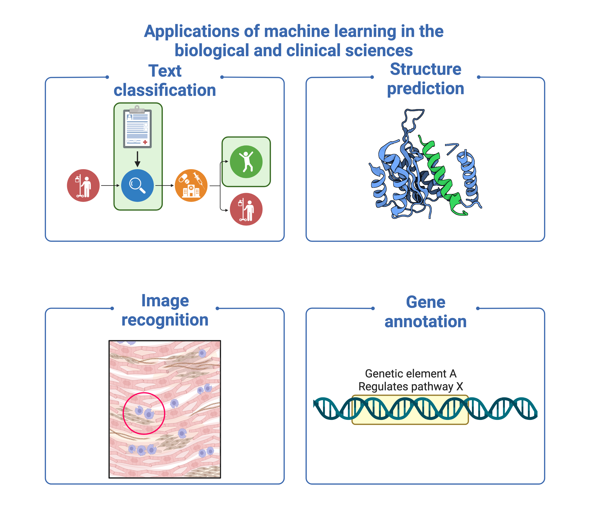

Meanwhile, genomics involves the study of the genome, which contains 
the entire genetic content of an organism. As the primary blueprint, 
it is an important source of information and underpins all biological 
experiments, directly or indirectly.

Why apply NLP in genomics
-------------------------

Although NLP has been shown to effectively preprocess and extract "meaning" from
human language, until recently, its application in biology was mostly
centred around biological literature and electronic health record mining.
However, we note the striking similarities between genomic sequence data
and human languages that make it well-suited to NLP. 
(A) DNA can be directly expressed as human language, being composed of text 
strings such as A, C, T, G, and having its own semantics as well as grammar. 
(B) Large quantities
of biological data are available in the public domain, with a growth rate
exponentially exceeding astronomy and social media platforms combined.
(C) Recent advances in machine learning which improve the scalability of 
deep learning (DL) make computational analysis of genomic data feasible.

.. NOTE::

  `The same is true for protein sequences, and nucleic acid data such as 
  transcripts. While our pipeline can process any of these, the scope of
  this tutorial is for genomic data only.`

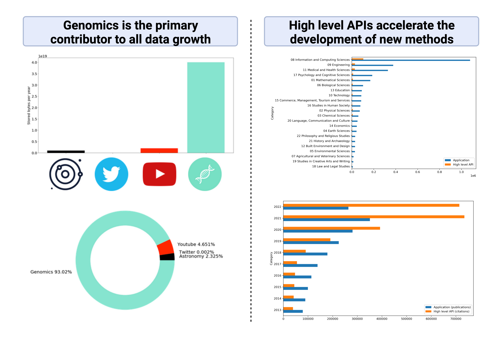

We therefore make a distinction between the field of conventional 
literature or electronic health record mining and the application of NLP 
concepts and methods to the genome. We call this field *genome NLP*.
The aim of *genome NLP* would be to extract relevant information from
the large corpora of biological data generated by experiments, such as
gene names, point mutations, protein interactions and biological pathways.
Applying concepts used in NLP can potentially enhance the analysis and 
interpretation of genomic data, with implications for research in
personalised medicine, drug discovery and disease diagnosis.

Distinction between conventional NLP and genome NLP
---------------------------------------------------

Several key differences need to be accounted for for implementing NLP on the genome. 
(A) The first challenge is the tokenisation of long biological sequences
into smaller subunits. While some natural languages have subunits 
separated by spaces, enabling easy segmentation, this is not
true in biological sequence data, and this also applies to an extent in many 
languages such as Arabic, Chinese or Sanskrit characters. (B) A second 
challenge is the diversity and high degree in nuance of biological 
experiments. As a result, interpretability and interoperability of 
biological data is highly restricted in scope, even within a single 
experiment. (C) The third challenge is the difficulty in comparing 
models, partly due to the second challenge, and partly due to the lack 
of accessible data in the biomedical field for privacy reasons, 
and partly because of the `limited enforcement of biological data integrity 
as well as metadata by journals`_. In addition, the large volume of biological 
data in a single experiment makes re-training time consuming.

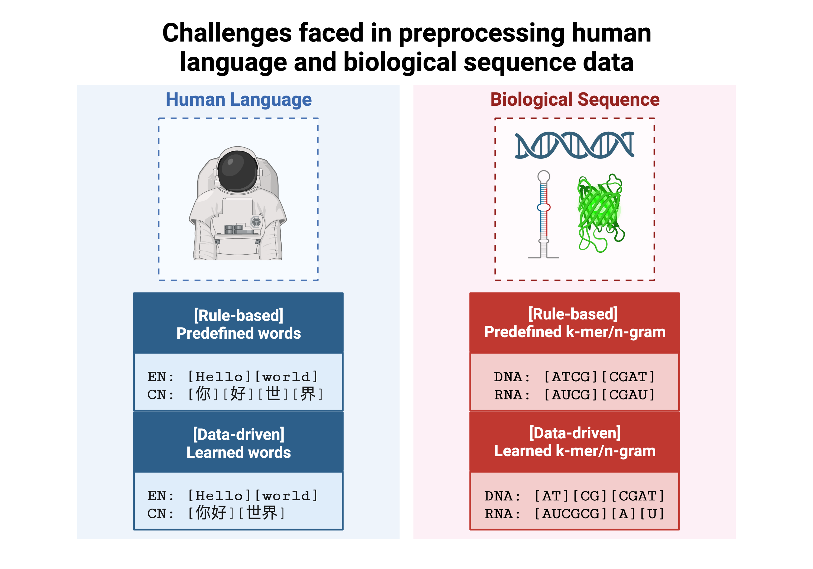

.. _limited enforcement of biological data integrity as well as metadata by journals: https://academic.oup.com/view-large/figure/129641572/gky1064fig3.jpg

To address the challenges in genome-NLP, we used a new semi-automated workflow.
This workflow integrates feature engineering and machine
learning techniques and is designed to be adaptable across different
species and biological sequences, including nucleic acids and proteins. 
The workflow includes the introduction of a (1) new tokeniser for
biological sequence data which effectively tokenises contiguous genomic 
sequences while retaining biological context. This minimises
manual preprocessing, reduces vocabulary sizes, and (2) handles unknown
biological terms, conceptually identical to the out-of-vocabulary (OOV)
problem in natural languages. (3) Passing the preprocessed data to a 
``genomicBERT`` algorithm allows for direct biological sequence input
to a state-of-the-art deep learning algorithm. (4) We also enable model
comparison by weights, removing the need for computationally expensive
re-training or access to raw data. To promote collaboration and adoption, 
``genomicBERT`` is available as part of the publicly accessible conda 
package called ``genomeNLP``. `Successful case studies`_ have demonstrated 
the effectiveness of ``genomeNLP`` in ``genome NLP`` applications.

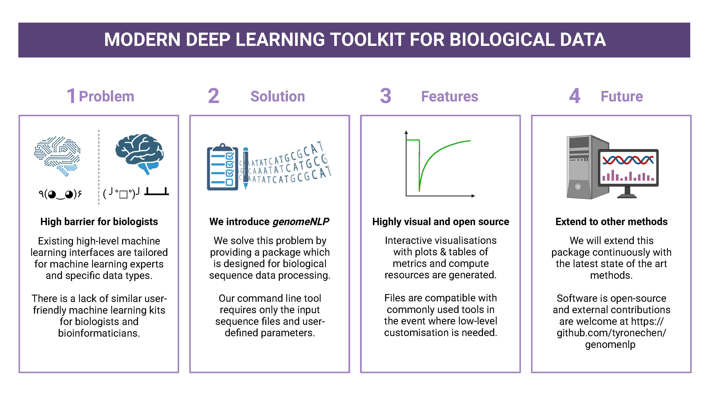

.. _Successful case studies: https://doi.org/10.5281/zenodo.8135590

2. Connect to a remote server
=============================

.. NOTE::

  `If you are unable to access the command line, you can follow the workshop
  using jupyter notebooks. Navigate to https://colab.research.google.com,
  select the GitHub tab, and paste this link 
  https://github.com/tyronechen/genomenlp/blob/main/src/jupyter/case_study_dna.ipynb`

To standardise the compute environment for all participants, we will be 
establishing a network connection with a remote server. Data and a working
install of ``genomenlp`` is provided. Secure Shell (SSH) is a common method 
for remote server connection, providing secure access and remote command 
execution through encrypted connections between the client and server.

.. NOTE::

  `Login details will be provided by instructors on the day of the workshop.
  If you have problems logging in, please contact the instructor.`

To use ``ssh`` (Secure Shell) for remote server access, please follow these steps:

1. Open a Terminal or Command Prompt on your local machine. SSH is
   typically available on Unix-like systems (e.g. Linux, macOS) and
   can also be installed on Windows systems using tools like
   `PuTTY <https://www.chiark.greenend.org.uk/~sgtatham/putty/latest.html>`__
   or `MobaXterm <https://mobaxterm.mobatek.net/download.html>`__.

2. Determine the ``ssh`` command syntax. Generally the format is:
   ``ssh username@hostname`` or the IP address of the remote server.

3. Enter your password or passphrase when prompted. Once authenticated,
   you should be connected to the remote server via SSH.

.. NOTE::

  `Details for (2) and (3) will be provided on the day of the workshop.`

  `Please login using one user from this list. If you are using ssh, "ssh userID@IPADDRESS" where you replace ID and IPADDRESS from this list. Note that one person can only use one userID and IPADDRESS combination. This is a temporary server provided by Australian BioCommons and will be removed after today. <https://github.com/tyronechen/genomenlp_tutorials/blob/main/etc/temporary_logins.csv>`_

  `IF you choose not to use this, you can also follow in google colaboratory or watch the lecture.`

3. Installing conda, mamba and genomenlp
========================================

.. NOTE::

  `This step is already performed for you. Information is provided as 
  a guide for those who are reading this document outside of the 
  tutorial, or if for some reason the installation is not working.`

A package/environment manager is a software tool that automates the
installation, update, and removal of packages and allows for the
creation of isolated environments with specific configurations. This
simplifies software setup, reduces compatibility issues, and improves
software development workflows. Popular examples include ``apt`` and 
``anaconda``. We will use ``conda`` and ``mamba`` in this case study.

.. NOTE::

  `The same is true for protein sequences, and nucleic acid data such as 
  transcripts. While our pipeline can process any of these, the scope of
  this tutorial is for genomic data only.`

To install ``conda`` using the command line, you can follow these steps:

1. Open your command prompt. Use the ``curl`` or ``wget`` command to 
   download the installer directly from the command line using its URL.

.. code-block:: bash

     $ wget 'https://repo.anaconda.com/miniconda/Miniconda3-py39_23.3.1-0-Linux-x86_64.sh'

2. Run the installer script using the following command:

.. code-block:: bash

     $ bash Miniconda3-py39_23.3.1-0-Linux-x86_64.sh

3. Follow the on-screen prompts to proceed with the installation. (In the prompt asking
   for the location for ``conda`` installation, please specify the directory as ``foo/bar``)

4. Reload your ``shell`` as shown below OR exit and return to complete the install.

.. code-block:: bash

     $ source ~/.bashrc
     $ source ~/.bash_profile

5. To install ``mamba``, which is a faster alternative to Conda for package management,
   run the following command:

.. code-block:: bash

    $ conda install mamba -n base -c conda-forge

.. NOTE::

  *`pip` does not work due to a missing pytorch dependency.
  `conda` is very slow due to the large dependency tree.*

6. As with Step 4, reload your shell as below OR exit and return to complete the install.

.. code-block:: bash

    $ source ~/.bashrc
    $ source ~/.bash_profile

7. To install and activate ``genomenlp``, run the following commands:

.. code-block:: bash

    $ mamba create -n genomenlp -c tyronechen -c conda-forge genomenlp -y
    $ mamba activate genomenlp
    # after the above completes
    $ sweep -h
    # you should see some output

4. Setting up a biological dataset
==================================

Understanding of the data and experimental design is a necessary first step to 
analysis. In our case study, we perform a simple two case classification, where 
the dataset consists of a corpora of biological sequence data belonging to two
categories. Genomic sequence associated with promoters and non-promoter regions
are available. In the context of biology, promoters are important modulators of
gene expression, and most are relatively short as well as information rich.
Motif prediction is an active, on-going area of research in biology, since many
of these signals are weak and difficult to detect, as well as varying in 
frequency and distribution across different species. **Therefore, our aim is to 
classify sequences into promoter and non-promoter sequence categories**.

.. NOTE::

  `A more detailed description of the data is available here.
  <https://github.com/khanhlee/bert-promoter>`__

Our data is available in the form of ``fasta`` files. ``fasta`` files are a common 
format for storing biological sequence data. They typically contain headers that 
provide information about the sequence, followed by  the sequence itself. They can 
also store other nucleic acid data, as well as protein. The ``fasta`` format contains 
headers with a leading ``>``. Lines without ``>`` contain biological sequence data 
and can be newline separated. In our simple example, the full set of characters are 
the DNA nucleotides adenine ``A``, thymine ``T``, cytosine ``C`` and guanine ``G``. 
These are the building blocks of the genetic code.

The files can be downloaded here for `non promoter sequences`_ and `promoter sequences`_.

.. _non promoter sequences: https://raw.githubusercontent.com/tyronechen/genomenlp/main/docs/data/non_promoter.fasta

.. _promoter sequences: https://raw.githubusercontent.com/tyronechen/genomenlp/main/docs/data/promoter.fasta

.. code-block:: bash

      # create the directory structure
      cd ~
      mkdir -p data src results
      cd data
      curl -L -O "https://raw.githubusercontent.com/tyronechen/genomenlp/main/docs/data/non_promoter.fasta"
      curl -L -O "https://raw.githubusercontent.com/tyronechen/genomenlp/main/docs/data/promoter.fasta"
      gzip non_promoter.fasta
      gzip promoter.fasta

.. code-block:: text

      HEADER:   >PCK12019 FORWARD 639002 STRONG
      SEQUENCE: TAGATGTCCTTGATTAACACCAAAAT
      HEADER:   >ECK12066 REVERSE 3204175 STRONG
      SEQUENCE: AAAGAAAATAATTAATTTTACAGCTG

.. NOTE::

  *In real world  data, other characters are available which refer to multiple possible
  nucleotides, for example ``W`` indicates either an ``A`` or a ``T``. RNA includes
  the character ``U``, and proteins include additional letters of the alphabet.*

Tokenisation in genomics involves segmenting biological sequences into smaller
units, called tokens (or k-mers in biology) for further processing. 
In the context of genomics, tokens can represent individual nucleotides, 
k-mers, codons, or other biologically meaningful segments. Just as in conventional NLP, 
tokenisation is required to facilitate most downstream operations.

Here, we provide gzipped fasta file(s) as input. While conventional biological
tokenisation splits a sequence into arbitrary-length segments, empirical 
tokenisation derives the resulting tokens directly from the corpus, 
with vocabulary size as the only user-defined parameter. 
Data is then split into training, testing and/or validation partitions
as desired by the user and automatically reformatted for input into the
deep learning pipeline.

.. NOTE::

  `We provide the conventional k-merisation method as well as an option for users.
  In our pipeline specifically, the empirical tokenisation and data object 
  creation is split into two steps, while k-merisation combines both in one
  operation. This is due to the empirical tokenisation process having to
  "learn" tokens from the data.`

.. code-block:: bash

      # Empirical tokenisation pathway
      cd ~/src
      tokenise_bio \
        -i ../data/promoter.fasta.gz \
           ../data/non_promoter.fasta.gz \
        -t ../data/tokens.json
      # -i INFILE_PATHS path to files with biological seqs split by line
      # -t TOKENISER_PATH path to tokeniser.json file to save or load data

This generates a ``json`` file with tokens and their respective weights or IDs.
You should see some output like this.

.. code-block:: text

      [00:00:00] Pre-processing sequences
      [00:00:00] Suffix array seeds
      [00:00:14] EM training
      Sample input sequence: AACCGGTT
      Sample tokenised: [156, 2304]
      Token: : k-mer map: 156  : : AA
      Token: : k-mer map: 2304 : : CCGGTT

5. Format a dataset for input into genomeNLP
============================================

In this section, we reformat the data to meet the requirements
of our pipeline which takes specifically structured inputs. This
intermediate data structure serves as the foundation for downstream
analyses and facilitates seamless integration with the pipeline.
Our pipeline contains a method that performs this automatically, generating a
reformatted dataset with the desired structure. 

.. NOTE::

  *The data format is identical to that used by the HuggingFace
  ``datasets`` and ``transformers`` libraries.*

.. code-block:: bash

      # Empirical tokenisation pathway
      create_dataset_bio \
        ../data/promoter.fasta.gz \
        ../data/non_promoter.fasta.gz \
        ../data/tokens.json \
        -o ../data/
      # -o OUTFILE_DIR write dataset to directory as 
      #   [ csv \| json \| parquet \| dir/ ] (DEFAULT:"hf_out/")
      # default datasets split: train 90%, test 5% and validation set 5%

The output is a reformatted dataset containing the same information.
Properties required for a typical machine learning pipeline are added,
including labels, customisable data splits and token identifiers.

.. code-block:: text

      DATASET AFTER SPLIT:
      DatasetDict ({
        train: Dataset ({
        features: ['idx', 'feature', 'labels', 'input_ids', 'token_type_ids', 'attention_mask’],
        num_rows: 12175 })
        test: Dataset ({
        features: ['idx', 'feature', 'labels', 'input_ids', 'token_type_ids', 'attention_mask’],
        num_rows: 677 })
        valid: Dataset ({
        features: ['idx', 'feature', 'labels', 'input_ids', 'token_type_ids', 'attention_mask’],
        num_rows: 676 })
      })

.. NOTE::

  *The column ``token_type_ids`` is not actually needed in this 
  specific case study, but it is safely ignored in such cases.*

.. code-block:: text

    SAMPLE TOKEN MAPPING FOR FIRST 5 TOKENS IN SEQ:
    TOKEN ID: 858  | TOKEN: TCA
    TOKEN ID: 2579 | TOKEN: GCATCAC
    TOKEN ID: 111  | TOKEN: TATT
    TOKEN ID: 99   | TOKEN: CAGG
    TOKEN ID: 777  | TOKEN: AGGCT

6. Preparing a hyperparameter sweep
===================================

In machine learning, achieving optimal model performance often requires
finding the right combination of hyperparameters (assuming the input
data is viable). Hyperparameters vary depending on the specific 
algorithm and framework being used, but commonly include learning rate, 
dropout rate, batch size, number of layers and optimiser choice. 
These parameters heavily influence the learning process and subsequent 
performance of the model. 

For this reason, hyperparameter sweeps are normally carried out to 
systematically test combinations of hyperparameters, with the end goal of 
identifying the configuration that produces the best model performance.
Usually, sweeps are carried out on a small partition of the data only
to maximise efficiency of compute resources, but it is not uncommon to
perform sweeps on entire datasets. Various strategies, 
such as grid search, random search, or bayesian optimisation, can be 
employed during a hyperparameter sweep to sample parameter values.
Additional strategies such as early stopping can also be used.

To streamline the hyperparameter optimization process, we use the
``wandb`` (Weights & Biases) platform which has a user-friendly interface
and powerful tools for tracking experiments and visualising results.

First, sign up for a wandb account at: https://wandb.ai/site and login
by pasting your API key.

.. code-block:: bash

    wandb login
    wandb: Paste an API key from your profile, and hit enter and hit enter or press ctrl+c to quit:

.. NOTE::

  `If you are running this on jupyter notebooks, the field to paste the API key
  is present but invisible (click the space just after the most recent output).`

Now, we use the ``sweep`` tool to perform hyperparameter sweep. Search
strategy, parameters and search space are passed in as a ``json`` file.
An example is below. If no sweep configuration is provided, default configuration will apply.

.. raw:: html

   

   
<a>Default hyperparameter sweep settings if none are provided. You can copy this file and edit it for your own use if needed.</a>

.. code-block:: json

  {
      "name": "random",
      "method": "random",
      "metric": {
          "name": "eval/f1",
          "goal": "maximize"
          },
      "parameters": {
          "epochs": {
              "values": [1, 2, 3, 4, 5]
              },
          "dropout": {
            "values": [0.15, 0.2, 0.25, 0.3, 0.4]
          },
          "batch_size": {
              "values": [8, 16, 32, 64]
              },
          "learning_rate": {
              "distribution": "log_uniform_values",
              "min": 1e-5,
              "max": 1e-1
          },
          "weight_decay": {
              "values": [0.0, 0.1, 0.2, 0.3, 0.4, 0.5]
          },
          "decay": {
              "values": [1e-5, 1e-6, 1e-7]
          },
          "momentum": {
              "values": [0.8, 0.9, 0.95]
          }
      },
      "early_terminate": {
          "type": "hyperband",
          "s": 2,
          "eta": 3,
          "max_iter": 27
      }
  }

.. raw:: html

   

.. code-block:: bash

    sweep \
      ../data/train.parquet \
      parquet \
      ../data/tokens.json \
      -t ../data/test.parquet \
      -v ../data/valid.parquet \
      -w ../data/hyperparams.json \   # optional
      -e entity_name \       # <- edit as needed
      -p project_name \      # <- edit as needed
      -l labels \
      -n 3
    # -t TEST, path to [ csv \| csv.gz \| json \| parquet ] file
    # -v VALID, path to [ csv \| csv.gz \| json \| parquet ] file
    # -w HYPERPARAMETER_SWEEP, run a hyperparameter sweep with config from file
    # -e ENTITY_NAME, wandb team name (if available).
    # -p PROJECT_NAME, wandb project name (if available)
    # -l LABEL_NAMES, provide column with label names (DEFAULT: "").
    # -n SWEEP_COUNT, run n hyperparameter sweeps

.. code-block:: text

    *****Running training*****
    Num examples = 12175
    Num epochs= 1
    Instantaneous batch size per device = 64
    Total train batch size per device = 64
    Gradient Accumulation steps= 1
    Total optimization steps= 191

The output is written to the specified directory, in this case
``sweep_out`` and will contain the output of a standard ``pytorch`` 
saved model, including some ``wandb`` specific output.

.. add sample output here

The sweeps gets synced to the ``wandb`` dashboard along with various
interactive custom charts and tables which we provide as part of our
pipeline. A small subset of plots are provided for reference. 
Interactive versions of these and more plots are available on wandb.

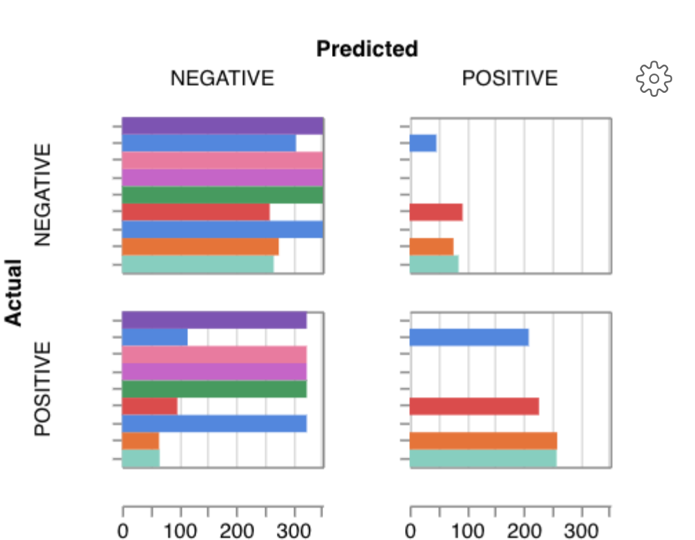

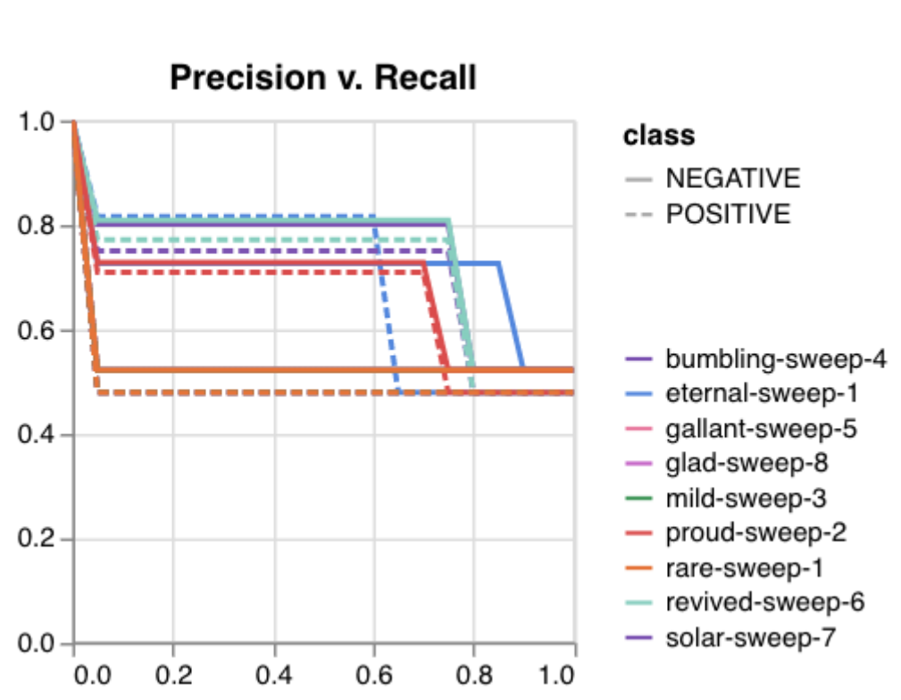

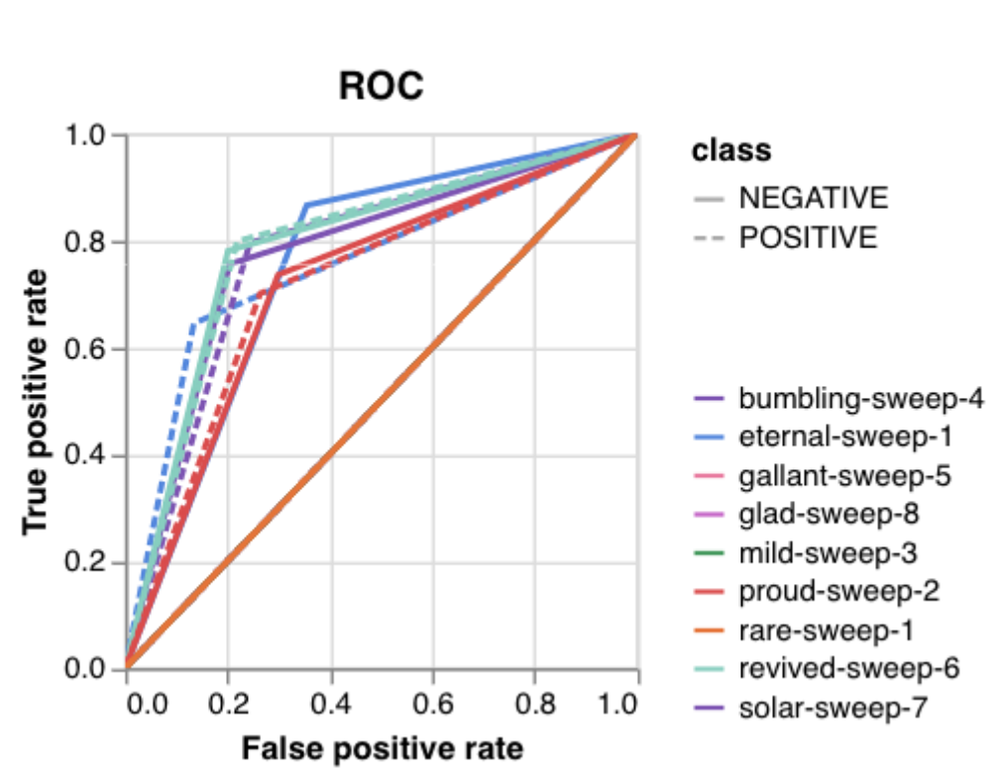

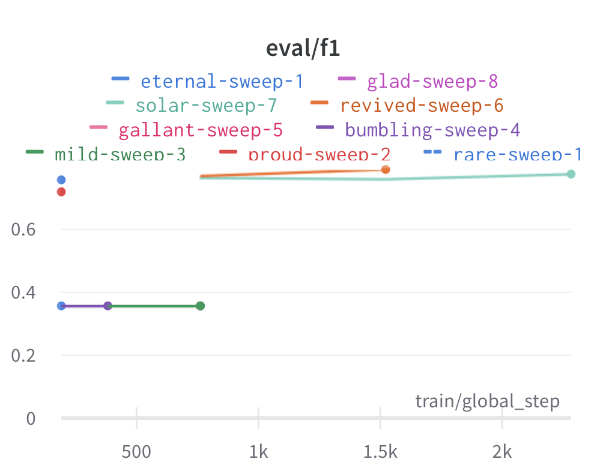

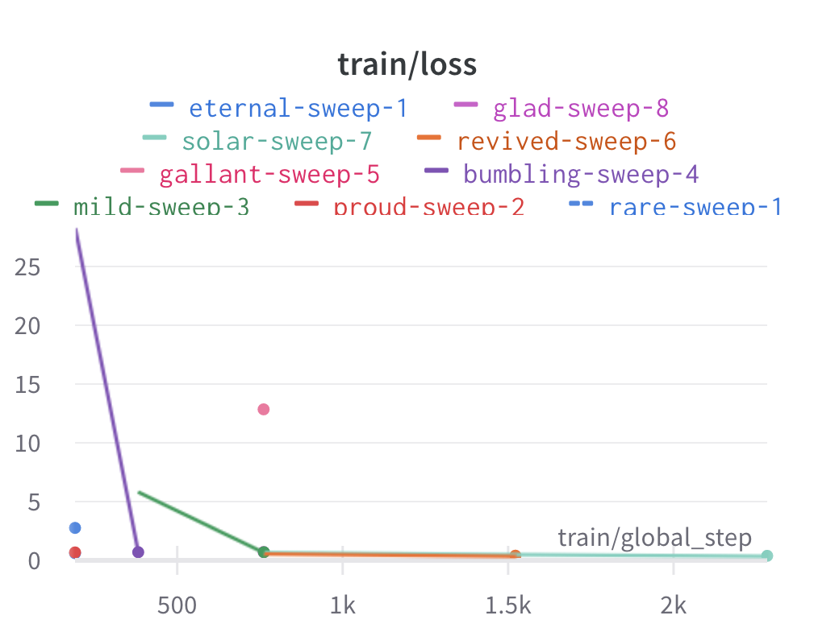

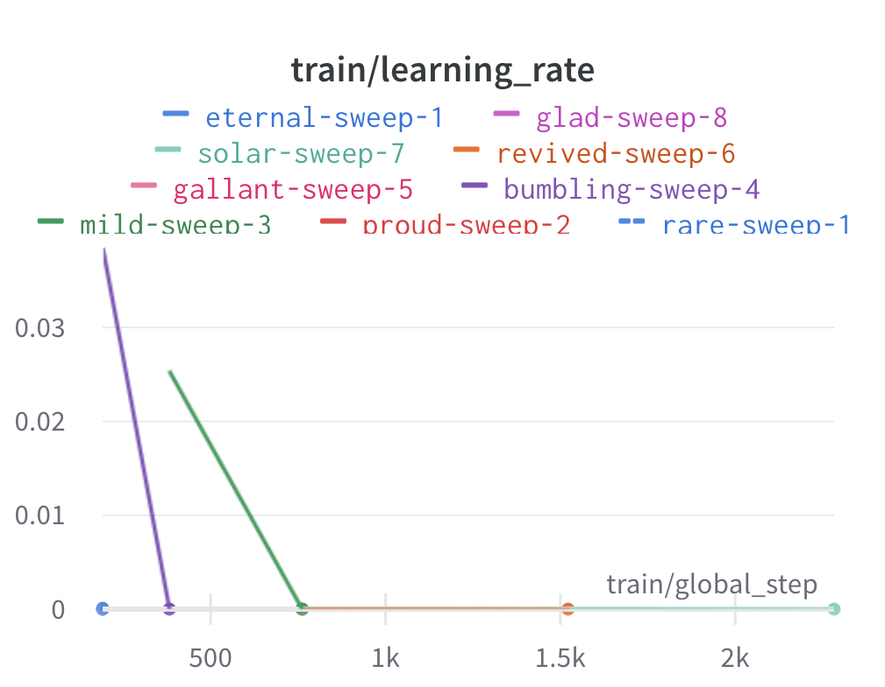

`Here is an example of a full wandb generated report:
<https://api.wandb.ai/links/tyagilab/a56uxmff>`__

You may inspect your own generated reports after they complete.

.. add explanation of report

7. Selecting optimal hyperparameters for training
=================================================

Having completed a sweep, we next identified the best set
of parameters for model training. We do this by examining training metrics.
These serve as quantitative measures of a model's performance during 
training. These metrics provide insights into the model's accuracy and 
generalisation capabilities. We explore commonly used training metrics, 
including accuracy, loss, precision, recall, and f1 score to inform us
of a model's performance

A key event we want to avoid is overfitting. Overfitting occurs when a 
learning model performs exceptionally well on the training data but 
fails to generalise to unseen data, making it unfit for use outside of the 
specific scope of the experiment. This can be detected by observing performance
metrics, if the accuracy decreases and later increases an overfit
event has occurred. In real world applications, this can 
lead to adverse events that directly impact us, considering that such
models are used in applications such as drug prediction or self-driving cars.
Here, we use the f1 score calculated on the testing set as the main 
metric of interest. We showed that we obtain a best ``f1`` score of ``0.79``.

.. code-block:: text

    Best run revived-sweep-6 with eval/f1=0.7900291349379833
    BEST MODEL AND CONFIG FILES SAVED TO: *./sweep_out/model_files*
    HYPERPARAMETER SWEEP END

`Here is an example of a full wandb generated report for the "best" run.
<https://wandb.ai//tyagilab/sweep/reports/Best-run-revived-sweep-6--Vmlldzo0OTExOTc1>`__

You may inspect your own generated reports after they complete.

.. add explanation of report

8. With the selected hyperparameters, train the full dataset
============================================================

In a conventional workflow, the sweep is performed on a small
subset of training data. The resulting parameters are then
recorded and used in the actual training step on the full dataset.
Here, we perform the sweep on the entire dataset, and hence
remove the need for further training. If you perform this on your
own data and want to use a small subset, you can do so and then
pass the recorded hyperparameters with the same input data to 
the ``train`` function of the pipeline. We include an example of 
this below for completeness, but you can skip this for our 
specific case study. Note that the input is almost identical to 
``sweep``.

.. code-block:: bash

    train \
      ../data/train.parquet \
      parquet \
      ../data/tokens.json \
      -t ../data/test.parquet \
      -v ../data/valid.parquet \
      --output_dir ../results/train_out \
      -f ../data/hyperparams.json \  # <- you can pass in hyperparameters
      -c entity_name/project_name/run_id \  # <- wandb overrides hyperparameters
      -e entity_name \   # <- edit as needed
      -p project_name    # <- edit as needed
    # -t TEST, path to [ csv \| csv.gz \| json \| parquet ] file
    # -v VALID, path to [ csv \| csv.gz \| json \| parquet ] file
    # -w HYPERPARAMETER_SWEEP, run a hyperparameter sweep with config from file
    # -e ENTITY_NAME, wandb team name (if available).
    # -p PROJECT_NAME, wandb project name (if available)
    # -l LABEL_NAMES, provide column with label names (DEFAULT: "").

.. NOTE::

  *Remove the ``-e entity_name`` line if you do not have a group setup in wandb*

.. raw:: html

   

   
<a>The contents of hyperparams.json, the file with the best hyperparameters identified by the sweep.</a>

.. code-block:: json

  {
    "output_dir": "./sweep_out/random",
    "overwrite_output_dir": false,
    "do_train": false,
    "do_eval": true,
    "do_predict": false,
    "evaluation_strategy": "epoch",
    "prediction_loss_only": false,
    "per_device_train_batch_size": 16,
    "per_device_eval_batch_size": 16,
    "per_gpu_train_batch_size": null,
    "per_gpu_eval_batch_size": null,
    "gradient_accumulation_steps": 1,
    "eval_accumulation_steps": null,
    "eval_delay": 0,
    "learning_rate": 7.796477400405317e-05,
    "weight_decay": 0.5,
    "adam_beta1": 0.9,
    "adam_beta2": 0.999,
    "adam_epsilon": 1e-08,
    "max_grad_norm": 1.0,
    "num_train_epochs": 2,
    "max_steps": -1,
    "lr_scheduler_type": "linear",
    "warmup_ratio": 0.0,
    "warmup_steps": 0,
    "log_level": "passive",
    "log_level_replica": "passive",
    "log_on_each_node": true,
    "logging_dir": "./sweep_out/random/runs/out",
    "logging_strategy": "epoch",
    "logging_first_step": false,
    "logging_steps": 500,
    "logging_nan_inf_filter": true,
    "save_strategy": "epoch",
    "save_steps": 500,
    "save_total_limit": null,
    "save_on_each_node": false,
    "no_cuda": false,
    "use_mps_device": false,
    "seed": 42,
    "data_seed": null,
    "jit_mode_eval": false,
    "use_ipex": false,
    "bf16": false,
    "fp16": false,
    "fp16_opt_level": "O1",
    "half_precision_backend": "auto",
    "bf16_full_eval": false,
    "fp16_full_eval": false,
    "tf32": null,
    "local_rank": -1,
    "xpu_backend": null,
    "tpu_num_cores": null,
    "tpu_metrics_debug": false,
    "debug": [],
    "dataloader_drop_last": false,
    "eval_steps": null,
    "dataloader_num_workers": 0,
    "past_index": -1,
    "run_name": "./sweep_out/random",
    "disable_tqdm": false,
    "remove_unused_columns": false,
    "label_names": null,
    "load_best_model_at_end": true,
    "metric_for_best_model": "loss",
    "greater_is_better": false,
    "ignore_data_skip": false,
    "sharded_ddp": [],
    "fsdp": [],
    "fsdp_min_num_params": 0,
    "fsdp_transformer_layer_cls_to_wrap": null,
    "deepspeed": null,
    "label_smoothing_factor": 0.0,
    "optim": "adamw_hf",
    "adafactor": false,
    "group_by_length": false,
    "length_column_name": "length",
    "report_to": [
      "wandb"
    ],
    "ddp_find_unused_parameters": null,
    "ddp_bucket_cap_mb": null,
    "dataloader_pin_memory": true,
    "skip_memory_metrics": true,
    "use_legacy_prediction_loop": false,
    "push_to_hub": false,
    "resume_from_checkpoint": null,
    "hub_model_id": null,
    "hub_strategy": "every_save",
    "hub_token": "<HUB_TOKEN>",
    "hub_private_repo": false,
    "gradient_checkpointing": false,
    "include_inputs_for_metrics": false,
    "fp16_backend": "auto",
    "push_to_hub_model_id": null,
    "push_to_hub_organization": null,
    "push_to_hub_token": "<PUSH_TO_HUB_TOKEN>",
    "mp_parameters": "",
    "auto_find_batch_size": false,
    "full_determinism": false,
    "torchdynamo": null,
    "ray_scope": "last",
    "ddp_timeout": 1800
  }

.. raw:: html

   

The output is written to the specified directory, in this case
``train_out`` and will contain the output of a standard ``pytorch`` 
saved model, including some ``wandb`` specific output.

The trained model gets synced to the ``wandb`` dashboard along with 
various interactive custom charts and tables which we provide as part 
of our pipeline. A small subset of plots are provided for reference. 
Interactive versions of these and more plots are available on wandb.

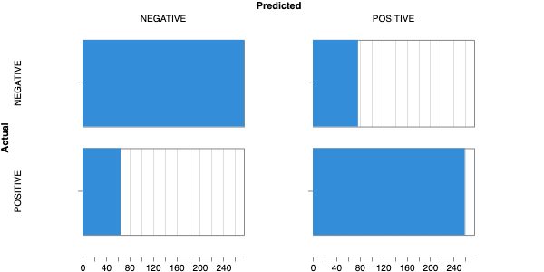

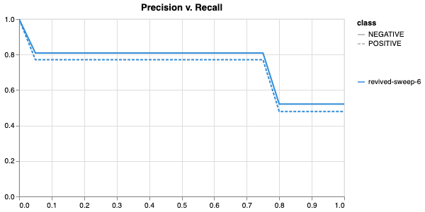

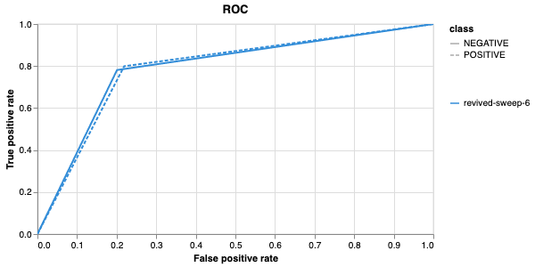

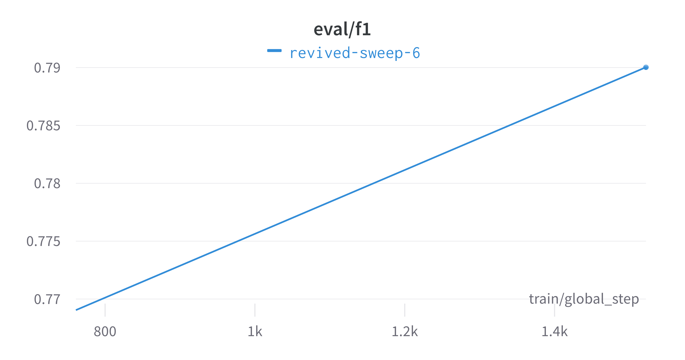

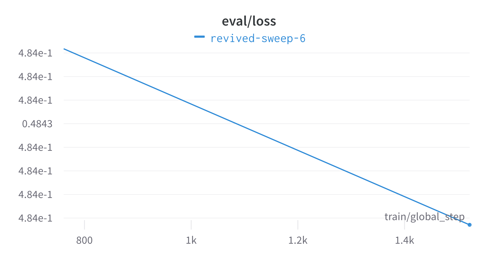

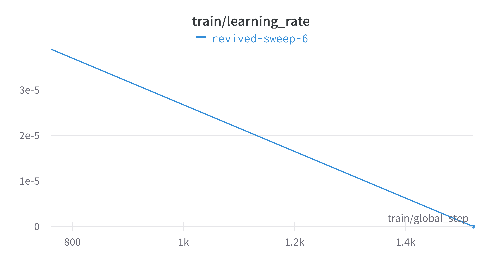

`Here is an example of a full wandb generated report:
<https://wandb.ai/tyagilab/sweep/reports/Best-run-revived-sweep-6--Vmlldzo0OTExOTc1>`__

You may inspect your own generated reports after they complete.

9. Perform cross-validation
===========================

Having identified the best set of parameters and trained the model, we 
next want to conduct a comprehensive review of data stability, and
we do this by evaluating model performance across different data slices. 
This assessment is known as cross-validation. We make use of k-fold
cross-validation in which data is divided into k subsets and
the model is trained and tested on these individual subsets.

.. code-block:: bash

    cross_validate \
      ../data/train.parquet parquet \
      -t ../data/test.parquet \
      -v ../data/valid.parquet \
      -e entity_name \              # <- edit as needed
      -p project_name \             # <- edit as needed
      --config_from_run p9do3gzl \  # id OR directory of best performing run
      --output_dir ../results/cv \
      -m ../results/sweep_out \     # <- overridden by --config_from_run
      -l labels \
      -k 8
    # --config_from_run WANDB_RUN_ID, *best run id*
    # –-output_dir OUTPUT_DIR
    # -l label_names
    # -k KFOLDS, run n number of kfolds

    cross_validate \
      ../data/train.parquet parquet \
      -t ../data/test.parquet \
      -v ../data/valid.parquet \
      -e tyagilab \              
      -p foobar \                
      -c tyagilab/foobar/kixu82co \  
      -o ../results/cv \
      -m ../results/sweep_out \
      -l labels \
      -k 8

.. NOTE::

  *If both ``model_path`` and ``config_from_run`` are specified, ``config_from_run`` overrides*

.. NOTE::

  *Remove the ``-e entity_name`` line if you do not have a group setup in wandb*

.. code-block:: text

    *****Running training*****
    Num examples = 10653
    Num epochs= 2
    Instantaneous batch size per device = 16
    Total train batch size (w, parallel, distributed & accumulation)= 16
    Gradient Accumulation steps= 1
    Total optimization steps= 1332
    Automatic Weights & Biases logging enabled

The cross-validation runs are uploaded to the ``wandb`` dashboard along 
with various interactive custom charts and tables which we provide as 
part of our pipeline. These are conceptually identical to those generated 
by ``sweep`` or ``train``. A small subset of plots are provided for reference. 
Interactive versions of these and more plots are available on wandb.

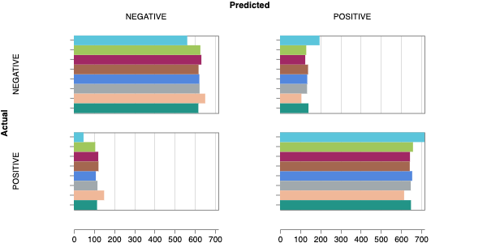

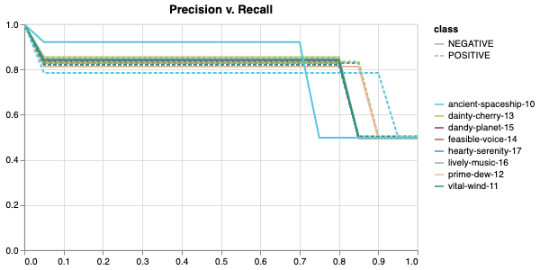

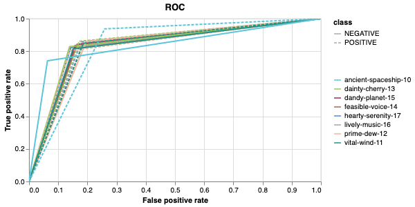

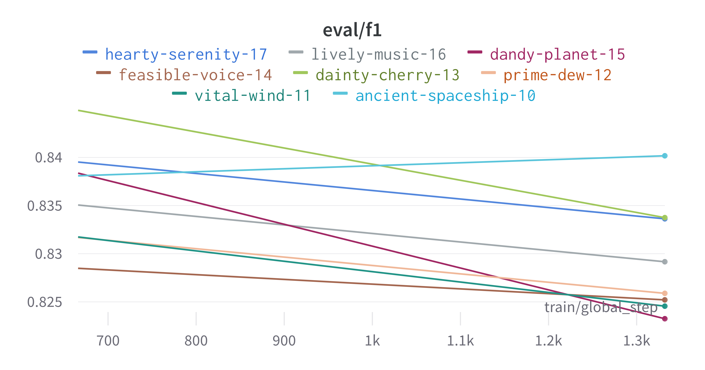

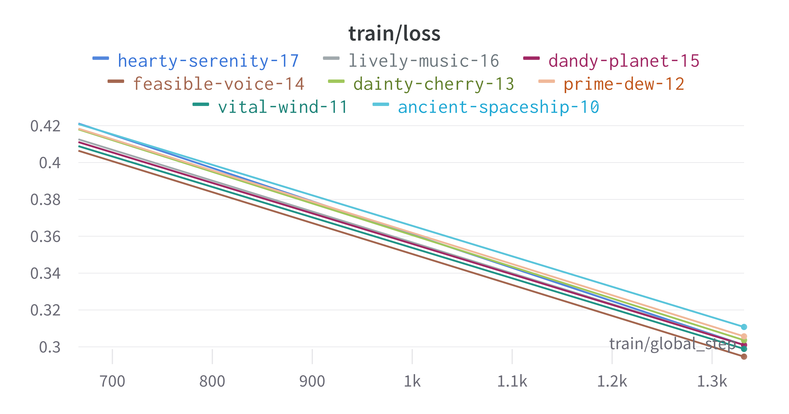

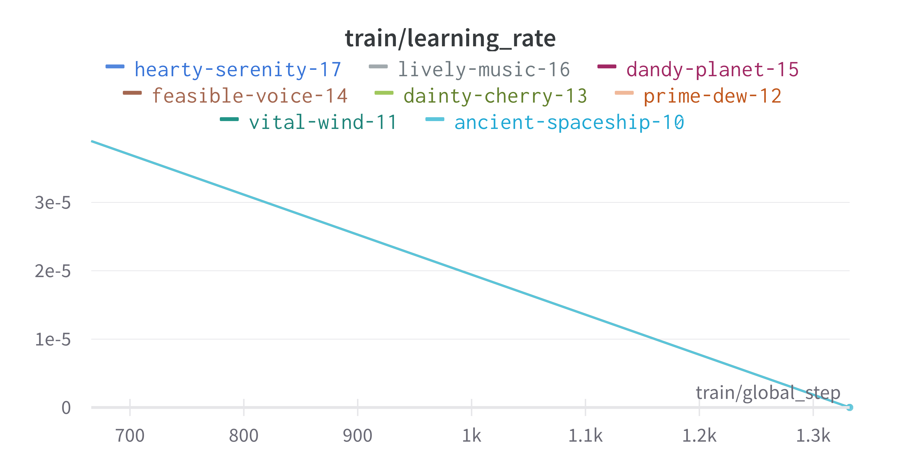

`Here is an example of a full wandb generated report:
<https://api.wandb.ai/links/tyagilab/8vony79x>`__

You may inspect your own generated reports after they complete.

10. Compare different models
============================

The aim of this step is to compare performance of different deep
learning models efficiently while avoiding computationally expensive
re-training and data download in conventional model comparison. 
In the case of patient data, they are often inaccessible for privacy 
reasons, and in other cases they are not uploaded by the authors of 
the experiment.

For the purposes of this simple case study, we compare multiple sweeps of the
same dataset as a demonstration. 
In a real life application, existing biological models
can be compared against the user-generated one.

.. code-block:: bash

    fit_powerlaw \
      ../results/sweep_out/model_files \
      -o ../results/fit
    # -m MODEL_PATH, path to trained model directory
    # -o OUTPUT_DIR, path to output metrics directory

This tool outputs a variety of plots in the specified directory.

.. code-block:: bash

    ls ../results/fit
    # alpha_hist.pdf  alpha_plot.pdf  model_files/

Very broadly, the overlaid bar plots allow the user to compare the
performance of different models on the same scale. A narrow band
around 2-5 with few outliers is in general cases an indicator of
good model performance. This is a general guideline and will differ
depending on context! `For a detailed explanation of these plots, 
please refer to the original publication. <https://arxiv.org/pdf/2202.02842.pdf>`__

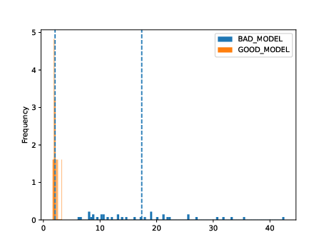

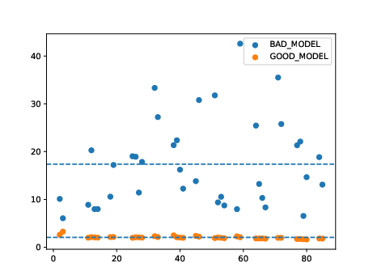
  

11. Obtain model interpretability scores
====================================

Model interpretability is often used for debugging purposes, by
allowing the user to "see" (to an extent) what a model is focusing on.
In this case, the tokens which contribute to a certain classification
are highlighted. The green colour indicates a classification towards
the target category, while the red colour indicates a classification
away from the target category. Colour intensity indicates the classification score.

.. ref to some famous interpretability examples
.. screenshot some html

In some scenarios, we can exploit this property by identifying 
regulatory regions or motifs in DNA sequences, or discovering amino
acid residues in protein structure critical to its function, leading 
to a deeper understanding of the underlying biological system.

.. code-block:: bash

    gzip -cd ../data/promoter.fasta.gz | \
      head -n10 > ../data/subset.fasta
    interpret \
      ../results/sweep_out/model_files \
      ../data/subset.fasta \
      -l PROMOTER NON-PROMOTER \
      -o ../results/model_interpret
    # -t TOKENISER_PATH, path to tokeniser.json file to load data
    # -o OUTPUT_DIR, specify path for output

.. code-block:: text

    ECK120010480 CSGDP1 REVERSE 1103344 SIGMA38.html
    ECK120010489 OSMCP2 FORWARD 1556606 SIGMA38.html
    ECK120010491 TOPAP1 FORWARD 1330980 SIGMA32 STRONG.html
    ECK120010496 YJAZP  FORWARD 4189753 SIGMA32 STRONG.html
    ECK120010498 YADVP2 REVERSE 156224  SIGMA38.html

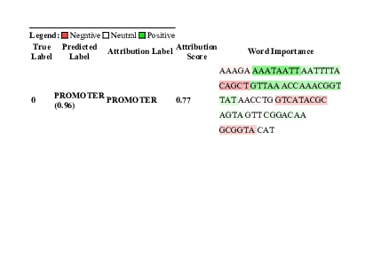

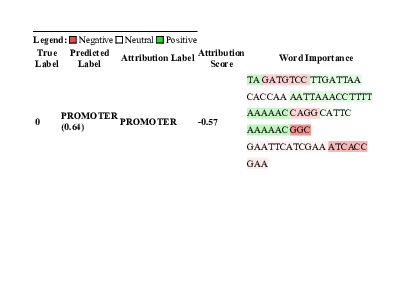

12. Interactive question and answer session
===========================================

Citation
========

Cite our manuscript here::

  @article{chen2023genomicbert,
      title={genomicBERT and data-free deep-learning model evaluation},
      author={Chen, Tyrone and Tyagi, Navya and Chauhan, Sarthak and Peleg, Anton Y and Tyagi, Sonika},
      journal={bioRxiv},
      month={jun},
      pages={2023--05},
      year={2023},
      publisher={Cold Spring Harbor Laboratory},
      doi={10.1101/2023.05.31.542682},
      url={https://doi.org/10.1101/2023.05.31.542682}
  }

Cite our software here::

  @software{tyrone_chen_2023_8135591,
    author       = {Tyrone Chen and
                    Navya Tyagi and
                    Sarthak Chauhan and
                    Anton Y. Peleg and
                    Sonika Tyagi},
    title        = {{genomicBERT and data-free deep-learning model 
                    evaluation}},
    month        = jul,
    year         = 2023,
    publisher    = {Zenodo},
    version      = {latest},
    doi          = {10.5281/zenodo.8135590},
    url          = {https://doi.org/10.5281/zenodo.8135590} 
  }
